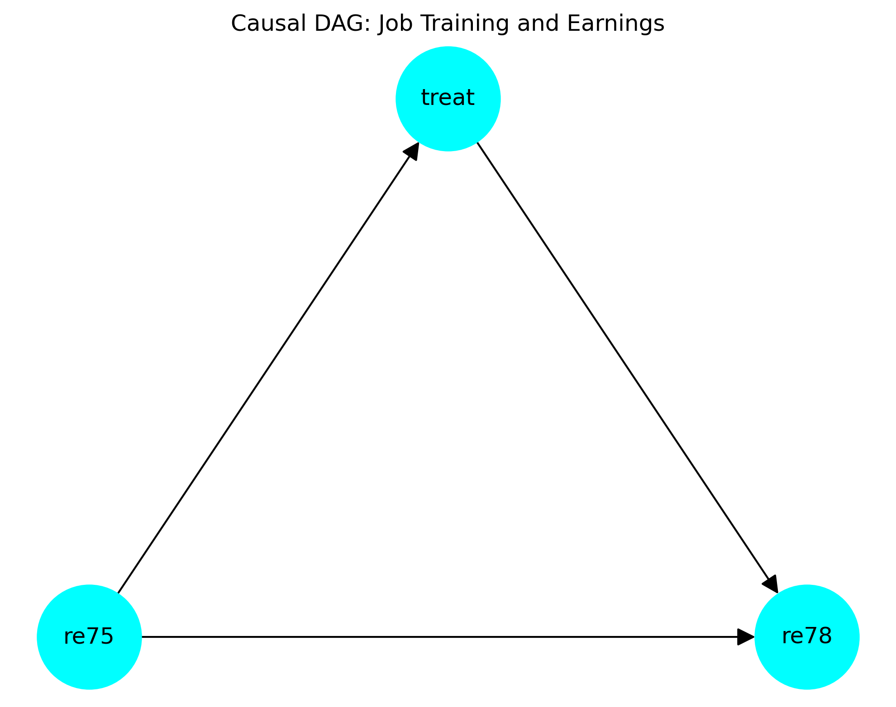

# Effect of Job Training on Future Earnings

**Course:** Foundations of Data Science  

**Group Members:** Nibish Tamrakar, Karthik Subramanium, Zubair Ali L

---

## 1. Introduction

### 1.1. The Question / Estimand

*What is the causal effect of participating in a job training program on future earnings, after adjusting for prior earnings?*

---

### 1.2. Data Description

- **Data Source:**  
  The analysis uses data from the National Supported Work (NSW) job training experiment compiled by LaLonde (1986), available via the NBER repository:  
  <https://users.nber.org/~rdehejia/data/.nswdata2.html>

- **Rows:**  
  Each row corresponds to one individual participant in the study *(722 individuals total)*.

- **Columns:**  
  The dataset includes indicators for program participation and earnings outcomes, along with background measures. Key variables used in our causal analysis are:
  - **treat:** Binary indicator of participation in the job training program  
    *(1 = treated, 0 = control)*
  - **re75:** Earnings in 1975 (pre-treatment), representing baseline economic status
  - **re78:** Earnings in 1978 (post-treatment), representing the outcome of interest

- **Relevance to the Causal Question:**  
  This dataset is well suited for estimating the causal effect of job training on future earnings because it originates from a randomized training program, providing credible treatment assignment. Crucially, it includes prior earnings (**re75**) measured before treatment, which plausibly influences both participation and later earnings. Adjusting for this confounder allows us to isolate the causal impact of training on post-program earnings (**re78**). Additionally, the clear temporal ordering — *baseline earnings → training participation → future earnings* — aligns directly with our estimand.

___
## 2. Causal Model

*The Directed Acyclic Graph (DAG) consists of three nodes and three directed edges:*

- **re75 → treat**
- **re75 → re78**
- **treat → re78**

*This DAG is connected and acyclic, representing our assumptions about how prior earnings, job training participation, and future earnings are causally related.*

### 2.1. Variables

*(Clearly label and describe your three variables (Treatment, Outcome, Confound). Do not use T, Y, Z. Use symbols that reflect the names of the variables from your dataset.)*

- **Treatment (treat):**  
  Binary indicator of participation in the job training program  
  *(1 = participated in training, 0 = did not participate)*

- **Outcome (re78):**  
  Individual earnings in 1978, measured after the job training period

- **Confound (re75):**  
  Individual earnings in 1975, measured before treatment and used as a proxy for baseline economic status, skill level, and employability

### 2.2. Assumed Causal Relationships

*The causal model assumes that prior earnings (**re75**) influence both job training participation (**treat**) and future earnings (**re78**). Individuals with lower or unstable earnings before the program may be more likely to enroll in job training, creating a causal path from **re75 → treat**. At the same time, prior earnings strongly predict later earnings due to persistent differences in skills, work experience, and labor market opportunities, forming the path **re75 → re78**.*

*The primary causal effect of interest is the direct impact of job training participation on future earnings, represented by **treat → re78**. Because **re75** affects both treatment assignment and the outcome, it acts as a confounder. Adjusting for **re75** blocks the backdoor path between **treat** and **re78**, allowing us to identify the causal effect of job training on future earnings under the assumptions encoded in the DAG.*

___

## 3. Statistical Model

We model **post-program earnings** in 1978 (`re78`) on the log scale to account for non-negativity and right-skewness. Let $Y_i = \text{re78}_i$ denote earnings in 1978 for individual $i$, and let $\text{treat}_i$ and $\text{re75}_i$ denote treatment status and prior earnings in 1975, respectively.

We assume the following statistical model:

$$
\log(Y_i + 1) \sim \text{Normal}(\mu_i, \sigma)
$$

$$
\mu_i = \alpha + \tau \cdot \text{treat}_i + \beta \cdot \log(1 + \text{re75}_i)
$$

where:
- $\alpha$ is the intercept,
- $\tau$ captures the causal effect of job training participation on (log) future earnings, after adjusting for prior earnings,
- $\beta$ measures the association between prior earnings and future earnings on the log scale.

We place the following priors on the parameters:

$$
\alpha \sim \text{Normal}(0, 5)
$$

$$
\tau \sim \text{Normal}(0, 5)
$$

$$
\beta \sim \text{Normal}(0, 5)
$$

$$
\sigma \sim \text{Half-Cauchy}(0, 2)
$$

---

### 3.1. Justification of Priors

The priors are chosen to be **weakly informative**, reflecting plausible ranges for effects while allowing the data to play the dominant role:

- The parameters $\alpha$, $\tau$, and $\beta$ are given $\text{Normal}(0, 5)$ priors.  
  On the log-earnings scale, a change of 5 units corresponds to a very large multiplicative change in earnings (e.g., $\exp(5) \approx 148$), so these priors are intentionally wide. This ensures we are not tightly constraining the regression coefficients while still discouraging extremely large, implausible values.

- The residual standard deviation $\sigma$ is given a $\text{Half-Cauchy}(0, 2)$ prior, a common weakly informative prior for scale parameters. It favors smaller values of $\sigma$ while still allowing for moderately large residual variation if supported by the data.

Overall, these priors encode the belief that:
1. Effects are likely to be centered near zero on the log scale (no strong prior belief about large positive or negative effects), and  
2. The model allows enough flexibility to fit realistic earnings patterns without over-regularizing.

---

### 3.2. Justification of Outcome Distribution

Raw earnings (`re78`) are:
- **Non-negative**,  
- **Right-skewed**, with a small number of individuals earning much more than the median, and  
- Sometimes equal to zero.

To address these characteristics, we model $\log(Y_i + 1)$ rather than $Y_i$ directly:

- The log transformation reduces right skew and makes the distribution of transformed earnings closer to symmetric and approximately Normal.
- Adding 1 inside the log, $\log(Y_i + 1)$, allows us to handle individuals with zero earnings without discarding them or requiring a separate model.
- On the transformed scale, it is reasonable to assume approximately constant variance and a Normal error distribution, which justifies the Normal likelihood:
  $$
  \log(Y_i + 1) \sim \text{Normal}(\mu_i, \sigma).
  $$

Thus, the Normal distribution is used not for raw earnings, but for their log-transformed values, which better match the assumptions of the statistical model.

---

### 3.3. Handling the Confound

Our causal DAG indicates that prior earnings in 1975 (`re75`) act as a **confounder**, affecting both:

- The probability of participating in the job training program (`treat`), and  
- Future earnings in 1978 (`re78`).

In the statistical model, we handle this confounding by **conditioning on `re75`** through its log-transformed version:

$$
\mu_i = \alpha + \tau \cdot \text{treat}_i + \beta \cdot \log(1 + \text{re75}_i).
$$

Including $\log(1 + \text{re75}_i)$ in the regression:

- Blocks the backdoor path $\text{treat} \leftarrow \text{re75} \rightarrow \text{re78}$,  
- Ensures that the estimated coefficient $\tau$ reflects the effect of job training on future earnings **after adjusting for differences in baseline earnings**, and  
- Aligns directly with the causal model specified in the DAG.

Under the assumptions encoded in the DAG (no unmeasured confounding beyond `re75`, correct model specification, and appropriate temporal ordering), the posterior for $\tau$ can be interpreted as a **causal effect** of job training on log-transformed future earnings, conditional on prior earnings.

___

